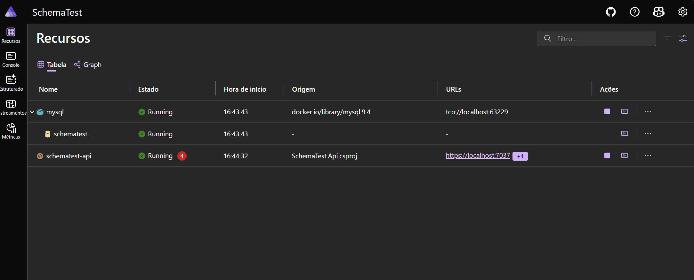
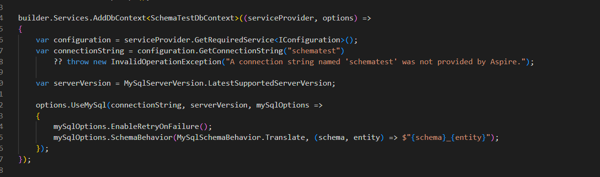
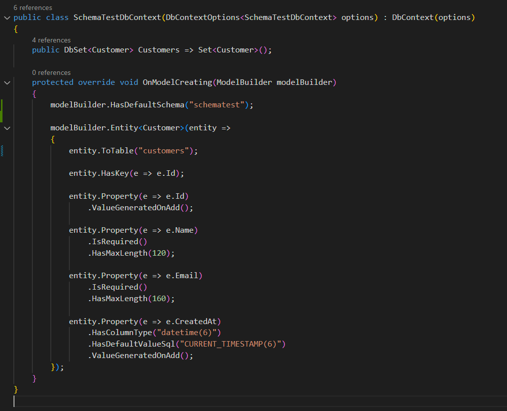

# MassTransit Multi-squad Sandbox

Este repositório contém experimentos e provas de conceito em torno do ecossistema .NET. A pasta principal atualmente é:

- `SchemaTest/` &mdash; POC que demonstra .NET 9 + Aspire + Entity Framework Core 9 com MySQL, incluindo compatibilidade com _schemas_ lógicos.

## Como começar

```pwsh
# entrar na pasta da POC principal
cd SchemaTest

# restaurar e compilar
dotnet build

# executar a aplicação distribuída (Aspire AppHost)
dotnet run --project SchemaTest.AppHost
```

> Requer .NET SDK 9 preview instalado e um runtime de containers ativo (ex.: Docker Desktop).

Para detalhes específicos da POC, consulte [`SchemaTest/README.md`](SchemaTest/README.md) e o [relatório de compatibilidade](SchemaTest/relatorio.md).

## Visão rápida






